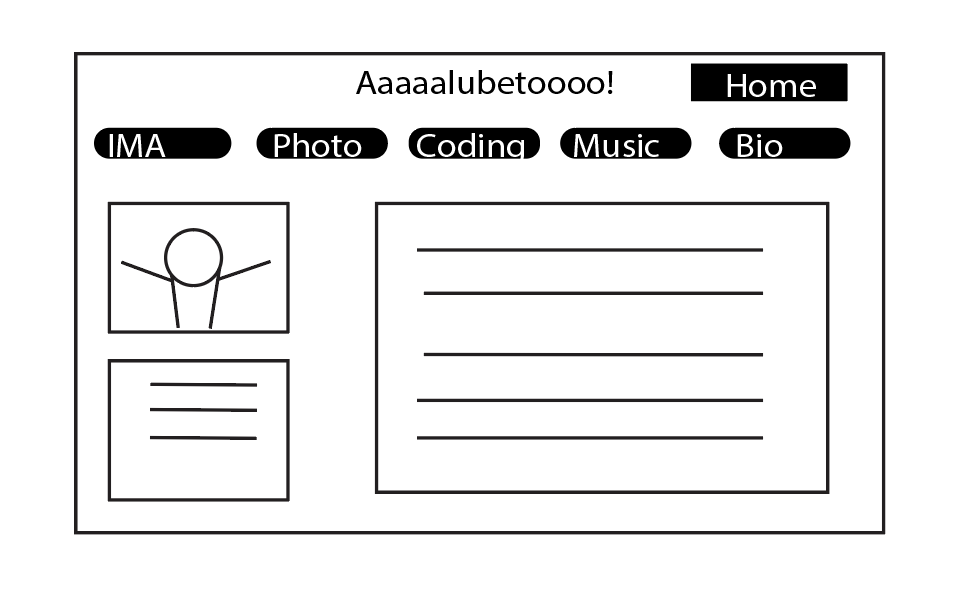
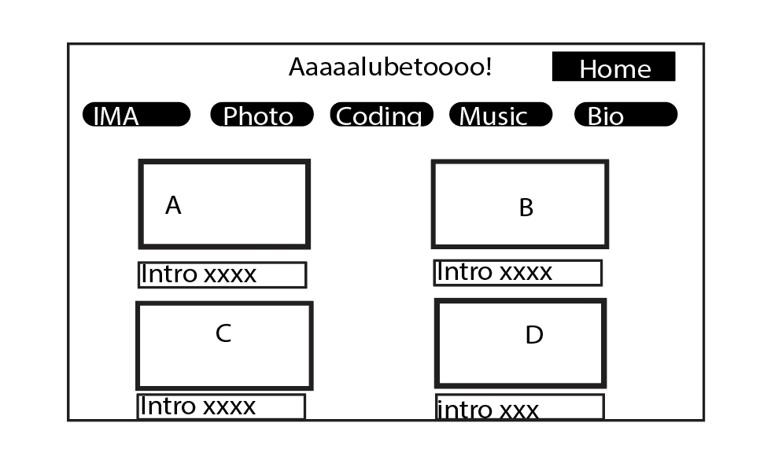
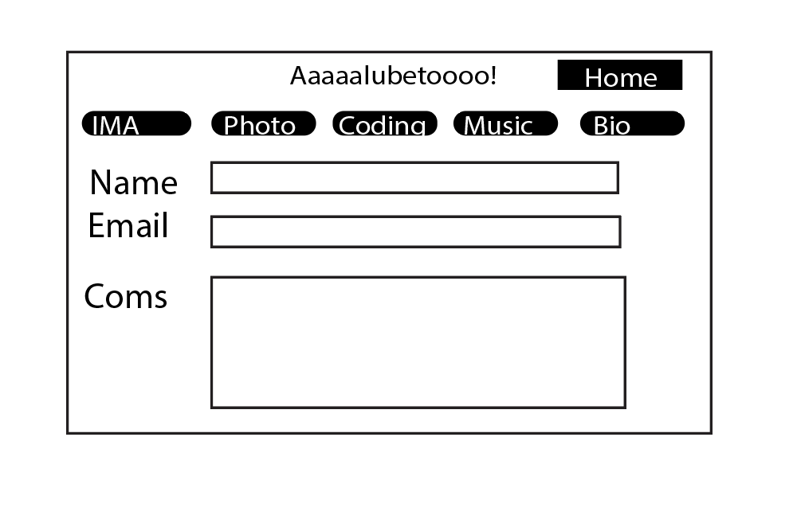

# Personal website

## Overview

I want to do a personal website. My minor is intergated digital media so I really need to build a website of my own to put all of my work in to that website so it can be seem by public. 

This website features multi-media display, including pictures, videos, and written documents. The home page should have some abbreviations of my selected art works and once users click them, they can go to see the description. 

The other feature of the website should contain contact information, users can leave their comments to my work and they also have a opportunity to leave their email address and send email to me.


## Data Model

Home page contains links to other media sites and contact page

* media sites includes 
  * Interactive media arts work
  * Photography
  * Music
  * Coding works (GitHub repository)
  * Papers

* contact page includes
  * email address
  * context (each email address can only )
  * send button


An Example User:

```javascript
{
  username: "SunXiaoChuan258",
  emailaddress: // ,
  comment: // an array of references to List documents
}
```

An Example List with Embedded Items:

```javascript
{
  user: // a reference to a User object
  emailaddress: // ,
  name: "LiLaoBa888",
  comments: [
    { name: "嗯冲🐛", commentId: 1},
    { name: "李法王🔥🔥🔥", commentId: 1},
  ],
  limit: // if the users with certain vaild email address have met their quota
}
```


## [Link to Commented First Draft Schema](db.js) 

(__TODO__: create a first draft of your Schemas in db.js and link to it_)

## Wireframes

(__TODO__: wireframes for all of the pages on your site; they can be as simple as photos of drawings or you can use a tool like Balsamiq, Omnigraffle, etc._)

/bio - page for displaying Bio



/home - Homepage showing all visible context



/comment - page for showing specific shopping list



## Site map

(__TODO__: draw out a site map that shows how pages are related to each other_)

Here's a [complex example from wikipedia](https://upload.wikimedia.org/wikipedia/commons/2/20/Sitemap_google.jpg), but you can create one without the screenshots, drop shadows, etc. ... just names of pages and where they flow to.

## User Stories or Use Cases

1. as a user, I can browse all the works published by the owner with the site
2. as a user, I can comment on works published by owner on the site
3. as a user, I can leave my email address along with my comments
4. as a owner, I can read all information leave by the viewer
5. as a owner, I can upload new posts

## Research Topics

(__TODO__: the research topics that you're planning on working on along with their point values... and the total points of research topics listed_)

* (5 points) Integrate user authentication
    * I'm going to be using passport for user authentication
    * And account has been made for testing; I'll email you the password
    * see <code>cs.nyu.edu/~jversoza/ait-final/register</code> for register page
    * see <code>cs.nyu.edu/~jversoza/ait-final/login</code> for login page
* (4 points) Perform client side form validation using a JavaScript library
    * see <code>cs.nyu.edu/~jversoza/ait-final/my-form</code>
    * if you put in a number that's greater than 5, an error message will appear in the dom
* (5 points) vue.js
    * used vue.js as the frontend framework; it's a challenging library to learn, so I've assigned it 5 points

10 points total out of 8 required points (___TODO__: addtional points will __not__ count for extra credit_)


## [Link to Initial Main Project File](app.js) 

(__TODO__: create a skeleton Express application with a package.json, app.js, views folder, etc. ... and link to your initial app.js_)

## Annotations / References Used

(__TODO__: list any tutorials/references/etc. that you've based your code off of_)

1. [passport.js authentication docs](http://passportjs.org/docs) - (add link to source code that was based on this)
2. [tutorial on vue.js](https://vuejs.org/v2/guide/) - (add link to source code that was based on this)

