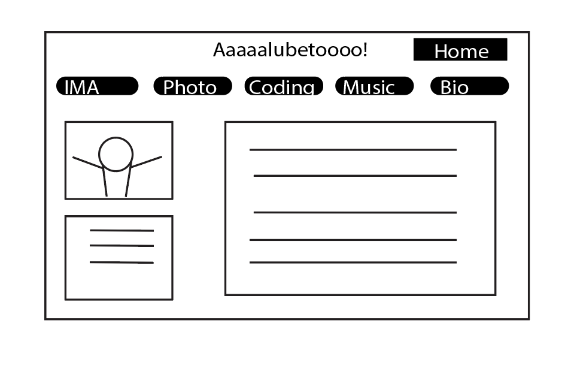
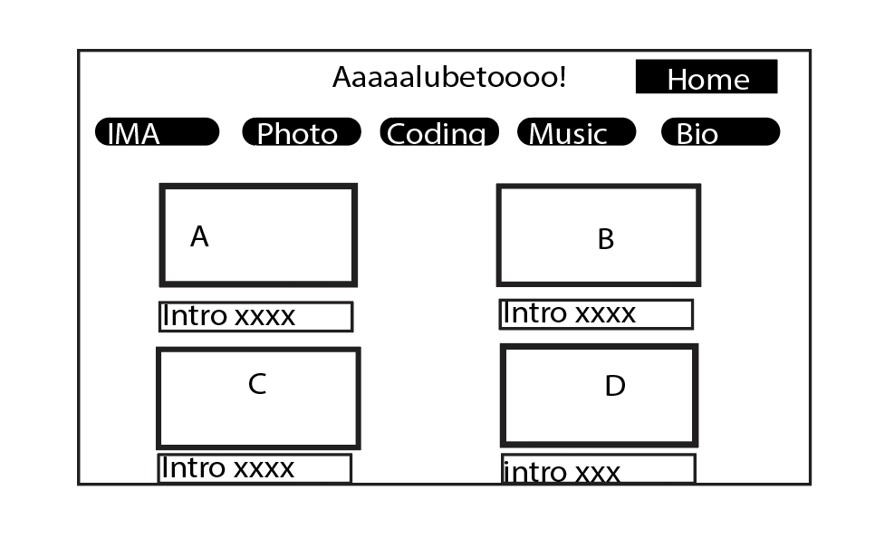

# Personal website

## Overview

I want to do a personal website. My minor is intergated digital media so I really need to build a website of my own to put all of my work in to that website so it can be seem by public. 

This website features multi-media display, including pictures, videos, and written documents. The home page should have some abbreviations of my selected art works and once users click them, they can go to see the description. 

The other feature of the website should contain contact information, users can leave their comments to my work and they also have a opportunity to leave their email address and send email to me.


## Data Model

Home page contains links to other media sites and contact page

* media sites includes 
  * Interactive media arts work
  * Photography
  * Music
  * Coding works (GitHub repository)
  * Papers

* contact page includes
  * alias
  * Work to be commented
  * time commented(System time)
  * context (each email address can only )
  * send button


An Example User:

```javascript
  const ReviewSchema = new mongoose.Schema({
    workCommented: String,
    commentContext: String,
    time: Number,
    alias: String
  });
```


## [Link to Commented First Draft Schema](db.js) 


## Wireframes

(__TODO__: wireframes for all of the pages on your site; they can be as simple as photos of drawings or you can use a tool like Balsamiq, Omnigraffle, etc._)

/bio - page for displaying Bio



/home - Homepage showing all visible context



/comment - page for showing specific shopping list


## Site map

(__TODO__: draw out a site map that shows how pages are related to each other_)

## User Stories or Use Cases

1. as a user, I can browse all the works published by the owner with the site
2. as a user, I can comment on works published by owner on the site
3. as a user, I can leave my email address along with my comments
4. as a owner, I can read all information leave by the viewer
5. as a owner, I can upload new posts

## Research Topics

(__TODO__: the research topics that you're planning on working on along with their point values... and the total points of research topics listed_)

* (1 points) Configure the more advance use of Github
  * I'm going to be familiar of deploying Github, understanding how to use
    * Merge
    * Pull request
    * handle version history
  * And account has been made for testing; I'll email you the password
* (1 points) Make the website indicate "Secure" instead of insecure
  * use https instead of http
* (3 points) Learn web design
  * understand how to do web design so I can make my website much more nicer
  * understand the use of CSS and html
  * learn rendering
* (3 points) GSAP for possible website animation
  * plain website is alwasys boring, so I would like to do some research on how to make it live with real-time effect
  * reference https://www.youtube.com/watch?v=sN93DRYkCO8
* (2 points) Client side form validation
  * I am going to figure out if the user is just submitting a comment.
  * Maybe consider using external sources to handle these problem

10 points total out of 8 required points 


## [Link to Initial Main Project File](app.js) 

/ project root
* public
  * Img
  * stylesheets
* views
  * layout.hbs
  * login.hbs
  * register.hbs
  * etc
* app.js
* db.js
* reviewsRoutes.js
* package.json
* README.md

## Annotations / References Used

(__TODO__: list any tutorials/references/etc. that you've based your code off of_)

1. [passport.js authentication docs](http://passportjs.org/docs) - (add link to source code that was based on this)
2. [tutorial on vue.js](https://vuejs.org/v2/guide/) - (add link to source code that was based on this)

